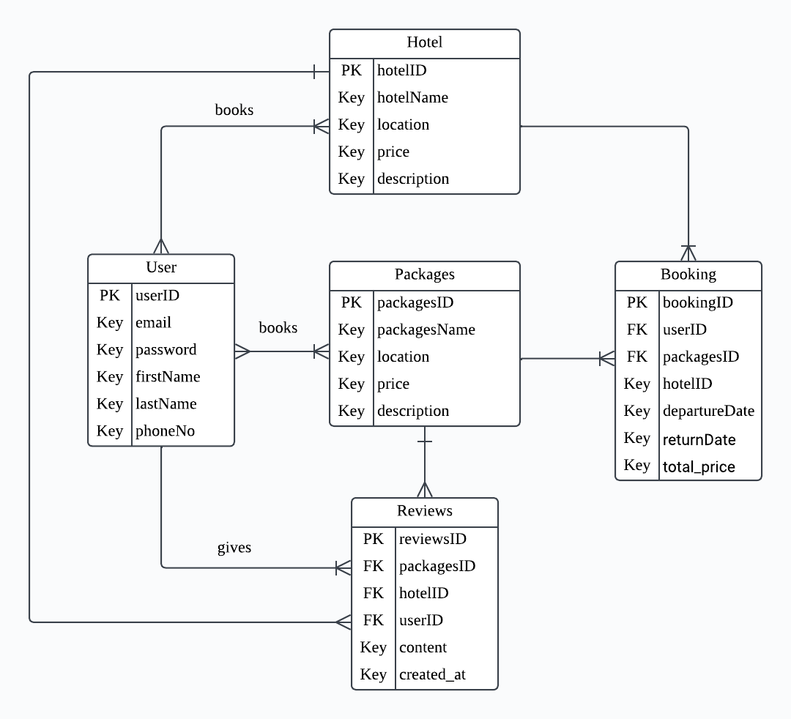

# TravelLokal

<h2 align="center">

  

INFO 3305 WEB APPLICATION DEVELOPMENT
  

SEMESTER 1 2023/2024
  

GROUP PROJECT PROPOSAL
  

SECTION 2
  

  
| Name        | Matric No           | 
| ------------- |:-------------:|
| MUHAMMAD ARIF FAISAL BIN ZAHARI      | 2117277 |
| MUHAMMAD ASYRAF BIN MOHD RADZI      | 2110473|
| MUHAMMAD BIN ABAS | 2113201     | 

</h2>

## Title of Group Project

TravelLokal: Where Every Destination Beckons

## Introduction

TravelLokal, an innovative web application, is set to revolutionize the exploration of Malaysia's hidden gems and local experiences. It's not just a planning tool for your next getaway but a portal to a world of wonders. The application offers personalized recommendations, user reviews and ratings, a travel itinerary planner, and connections with local guides for an authentic experience. Various promotions also come in TravelLokal, providing early bird discounts, seasonal deals, and a loyalty program to make the journey more exciting. These features and advertisements are designed to enhance your travel experience, making every click a new opportunity to create a wonderful memory in travel. We will always listen to and adapt to our users' feedback accordingly. Happy traveling with TravelLokal!

## Objectives

The main objective of TravelLokal is to build a user-centric platform that simplifies the entire travel experience inside a single location. The program promises to speed processes such as itinerary preparation, delivering tailored recommendations based on user preferences, and facilitating seamless bookings for hotels and transportation through intuitive design and user-friendly interfaces. The platform helps users to make wise decisions by centralizing local travel information, resulting in a more pleasurable and stress-free exploration of their selected destination.

## Features and functionalities

## ERD diagram with relationship. 

User books Packages or Hotel: 
* Many-to-many relationship
* A user can book multiple packages or hotels, and a package or hotel can be booked by multiple users.

User gives Review: 
* One-to-Many relationship.
* A user can gives many reviews, but a review can only be given by a user.

Review is about Packages or Hotel: 
* One-to-many relationship.
* A review can be about one package or hotel, but a package or hotel can have multiple reviews.

## Sequence diagram for interaction representation

